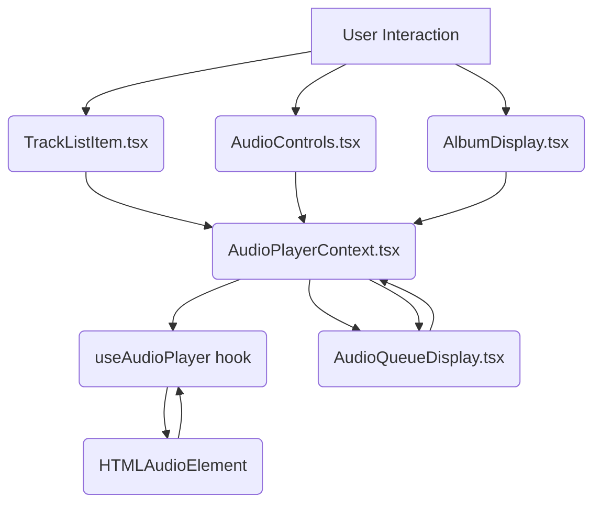

# Codebase Improvement Plan

This document outlines identified opportunities for general improvements in the application's codebase, focusing on user interface and experience, functionality, code quality, performance, accessibility, usability, and maintainability.

## Identified Improvement Opportunities:

1.  **Audio Player Functionality & State Management:**
    - **Shuffle Logic:** The current shuffle implementation is non-standard, only affecting playback after the queue ends. A more intuitive approach is to shuffle the current queue immediately when the shuffle button is toggled on.
    - **Track Playback Initiation:** Playing a track from the `TrackListItem` bypasses the central `playTrack` function in the context, leading to potential inconsistencies in state management.
    - **Error Handling:** Consolidate error reporting in the audio player to use `sonner` toasts consistently and remove redundant internal error states.
    - **Queue Display Clarity:** Simplify the empty state messages in the queue display component.

2.  **Content Display & Performance:**
    - **MDX Rendering Performance:** Client-side MDX serialization/evaluation can impact performance. Pre-compiling MDX files during the build process is a more performant approach for static content.
    - **Large Lists Performance:** For components displaying potentially long lists (like album tracks), implementing list virtualization can improve rendering performance.

3.  **Code Quality & Maintainability:**
    - **Hook Dependencies:** Review and ensure correct dependencies for all React hooks (`useEffect`, `useCallback`, `useMemo`) to prevent unexpected behavior or performance issues.
    - **State Management Structure:** Consider if a state reducer pattern in the `AudioPlayerContext` could simplify complex state transitions and logic.
    - **Caching Strategy:** Evaluate if the current `localStorage` caching in `useCachedData` is sufficient for anticipated data size and volatility, or if a more robust solution is needed. Add cache invalidation if necessary.

4.  **Accessibility & Usability:**
    - **Interactive Elements:** Verify comprehensive ARIA attributes, keyboard navigation, and focus management for all interactive UI components.
    - **Responsive Design:** Ensure the application layout and components are fully responsive and usable across various devices and screen sizes.

## Detailed Plan:

**Phase 1: Address Core Functionality Issues**

1.  **Refactor Shuffle Logic:**
    - Modify the `handleShuffle` function in [`src/lib/hooks/useAudioPlayer.ts`](src/lib/hooks/useAudioPlayer.ts) to immediately shuffle the current `queue` state when shuffle is turned ON.
    - Update the `playNextInQueue` logic in [`src/components/AudioPlayerContext.tsx`](src/components/AudioPlayerContext.tsx) to handle the case where the shuffled queue is exhausted (e.g., stop playback or loop the shuffled queue).
    - Ensure the `isShuffling` state is correctly persisted and loaded from `localStorage`.

2.  **Standardize Track Playback:**
    - In [`src/components/TrackListItem.tsx`](src/components/TrackListItem.tsx), modify the play/pause button `onClick` handler to call a new context method (e.g., `togglePlayPauseTrack(trackId)`) instead of directly interacting with `audioRef.current`.
    - Implement the `togglePlayPauseTrack` method in [`src/components/AudioPlayerContext.tsx`](src/components/AudioPlayerContext.tsx) to handle playing or pausing the specified track, updating the `selectedTrack` and `isPlaying` states accordingly.

3.  **Refine Audio Player Error Handling:**
    - Remove the internal `errorMessage` state from [`src/lib/hooks/useAudioPlayer.ts`](src/lib/hooks/useAudioPlayer.ts).
    - Ensure all error conditions within the hook and context directly trigger `sonner` toasts.

4.  **Simplify Queue Display Empty State:**
    - In [`src/components/AudioQueueDisplay.tsx`](src/components/AudioQueueDisplay.tsx), simplify the conditional rendering to display a single clear message when the queue is empty.

**Phase 2: Enhance Performance and Content Handling**

5.  **Implement MDX Pre-Compilation:**
    - Investigate integrating an MDX build plugin or script into the Vite configuration to pre-compile the markdown files in the `docs/` directory into React components during the build process.
    - Update the components that consume MDX ([`src/app/App.tsx`](src/app/App.tsx), [`src/components/CodexContent.tsx`](src/components/CodexContent.tsx), etc.) to import and render the pre-compiled components instead of fetching and compiling markdown client-side.
    - Remove or refactor [`src/components/ClientMdxRenderer.tsx`](src/components/ClientMdxRenderer.tsx), [`src/components/MdxRenderer.tsx`](src/components/MdxRenderer.tsx), and [`src/components/DocPageClient.tsx`](src/components/DocPageClient.tsx) if they are no longer needed after implementing pre-compilation.

6.  **Explore List Virtualization:**
    - Assess the typical number of tracks per album. If albums are expected to have a very large number of tracks, research and integrate a library like `react-window` or `react-virtualized` into [`src/components/AlbumDisplay.tsx`](src/components/AlbumDisplay.tsx) to virtualize the rendering of `TrackListItem` components.

**Phase 3: Review and Refactor**

7.  **Comprehensive Hook Dependency Review:**
    - Manually review all `useEffect`, `useCallback`, and `useMemo` hooks across the codebase, paying close attention to the audio player components and hooks, to ensure correct dependencies.

8.  **Evaluate State Management Pattern:**
    - Consider refactoring the state management in [`src/components/AudioPlayerContext.tsx`](src/components/AudioPlayerContext.tsx) to use `useReducer` if the state transitions become more complex, potentially improving predictability and testability.

9.  **Assess Caching Strategy:**
    - Based on the application's requirements and expected data size, decide if the current `localStorage` caching is sufficient or if a more advanced caching solution is necessary. Implement cache invalidation if needed.

10. **Accessibility and Usability Audit:**
    - Perform a thorough manual and automated accessibility audit (using browser developer tools and accessibility checkers).
    - Test the application on different devices and screen sizes to identify and address any usability issues.

## High-Level Component Interaction:

